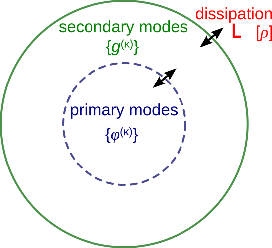
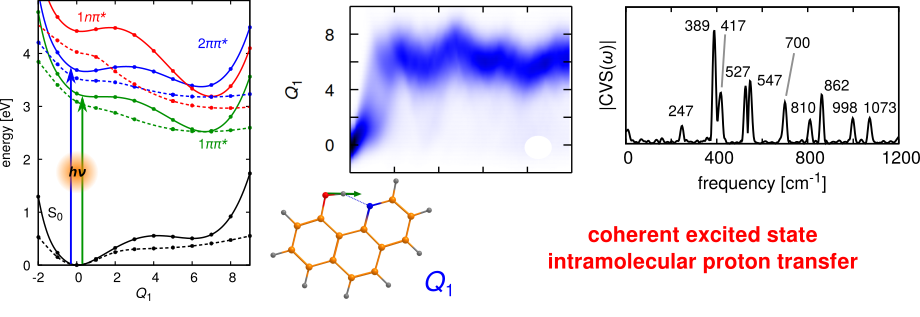

### Computational methods for high-dimensional molecular quantum systems
Molecular system subject to a perturbation, such as the interaction with a laser field, undergo chemical dynamics processes that, in the time scales of chemical bond motion, can display strong quantum effect. Therefore, processes like photodissociation, photoisomerisation, photoinduced charge and proton transfer, or the vibrational energy redistribution after interaction with an infrared laser, need to be modelled quantum mechanically. This is particularly challenging when many molecular degrees of freedom or electronic states need to be taken into account.

To simulate ultrafast high-dimensional quantum molecular dynamics we develop efficient **quantum wave packet methods**, that rely on multi-configurational electronic-vibrational wavefunctions. Computational efficiency is obtained by partitioning the molecular system into three parts: (1) a **primary** subsystem that includes the electronic states and the most relevant coordinates for the description of the investigate process - i.e. reaction coordinates, nonadiabatic coupling modes, etc.; (2) a **secondary** subsystem that accounts for the intramolecular vibrations most strongly coupled to the primary ones - that play a major role in intramolecular vibrational redistribution; (3) a **bath** that includes the remaining intramolecular vibrations as well as dissipative solvent modes.

In dynamical simulations, the bath is described by a collections of high-dimensional wave packets, constructed as multi-configurational wavefunctions where **fully flexible** functions are used for the primary modes and **Gaussian wave packets** are used for the secondary ones. This type of approach gives rise to Gaussian/Multi-Configurational Time-Dependent Hartree wavefunctions, which we implemented and successfully used in a number of applications, including the simulation of **time-resolved spectroscopy** [1,2]. 

Various methods for the treatment of the bath are currently under development. They include implicity Markovian descriptions (Lindblad or Caldeira-Leggett) [3], semi-implicit hierarchical equations for the "mean-field" influence of the bath [4], variational approaches and mixed quantum-classical schemes.

::: {#fig_hbq .figure}
{width=35%}
:::

**References**

[1] D. Picconi and I. Burghardt,
**Time-resolved spectra of I2 in a krypton crystal by G-MCTDH simulations: Nonadiabatic dynamics, dissipation and environment driven decoherence**, *Faraday Discuss.* **221**, 30 (2020). 
[DOI](https://doi.org/10.1039/C9FD00065H)

[2] D. Picconi, J. A. Cina and I. Burghardt,
**Quantum dynamics and spectroscopy of dihalogens in solid matrices. II. Theoretical aspects and G-MCTDH simulations of time-resolved coherent Raman spectra of Schrödinger cat states of the embedded I2Kr{18} cluster**,
*J. Chem. Phys.* **150**, 064112 (2019).
[DOI](https://doi.org/10.1063/1.5082651)

[3] D. Picconi and I. Burghardt,
**Open system dynamics using Gaussian-based multiconfigurational time-dependent Hartree wavefunctions: Application to environment modulated tunneling**,
*J. Chem. Phys.* **150**, 224106 (2019).
[DOI](https://doi.org/10.1063/1.5099983)

[4] D. Picconi,
**Dynamics of high-dimensional quantum systems coupled to a harmonic bath. General theory and implementation via multiconfigurational wave packets and truncated hierarchical equations for the mean-fields**,
*J. Chem. Phys.* **161**, 164108 (2024).
[DOI](https://doi.org/10.1063/5.0233708)

---

### Quantum mechanical description of ultrafast photoreactions
Photoinduced chemical reactions - such as photodissociation, excited state proton transfer, or photoisomerisation - that occur on ultrafast time scale ($< 10^{-12}$ s) can be influenced by **quantum effects**. For example, these effects involve a strong coupling between nuclear vibrational motion and electronic transitions (nonadiabatic photochemistry) or interference between different reaction pathways.

To model these phenomena we develop first principles protocols involving, in a first step, the **construction of high-dimensional multi-state potential energy surfaces** using electronic structure calculations. The surfaces include the reaction coordinates, treated as anharmonic modes, and the remaining molecular vibrations, model using general harmonic models that include mode-mode correlations (Duschinsky mixing). 

In a second step, these surfaces are used to simulate photoinduced dynamics via high-dimensional **quantum dynamics**. These simulations fully account for quantum effects and are performed using methods of the family of the Multi-Configurational Time-Dependent Hartree **(MCTDH)** approach, using hybrid formalism where Gaussian wave packets are used to treat the less relevant modes in a computationally efficient way.

::: {#fig_hbq .figure}
{width=100%}
:::

**References**  

[1] D. Picconi and S. Yu. Grebenshchikov,  **Intermediate photofragment distributions as probes of non-adiabatic dynamics at conical intersections: Application to the Hartley band of ozone**,  *Phys. Chem. Chem. Phys.* **17**, 28932 (2015).
[DOI](http://dx.doi.org/10.1039/c5cp04564a)  

[2] D. Picconi and S. Yu. Grebenshchikov, 
**Photodissociation dynamics in the first absorption band of pyrrole. II. Photofragment distributions for the ¹A₂(πσ\*) ← X̃ ¹A₁(ππ) transition**, 
*J. Chem. Phys.* **148**, 104104 (2018). 
[DOI](https://doi.org/10.1063/1.5019738)

[3] D. Picconi, 
**Nonadiabatic quantum dynamics of the coherent excited state intramolecular proton transfer of 10-hydroxybenzo[h]quinoline**, 
*Photochem. Photobiol. Sci.* **20**, 1455 (2021). 
[DOI](https://doi.org/10.1007/s43630-021-00112-z)

---

### Photophysics of non-canonical nucleobases studied via time-resolved X-ray spectroscopy
Since 2019 a collaboration is active with the group of Prof. Markus Gühr (Deutsches Elektronen-Synchrotron DESY) on the investigation of the photoinduced dynamics of **thionated nucleobases**. Thionucleobases are obtained from their canonical counterparts by the replacement of one or more oxygen atoms with sulphur. When compared to canonical nucleobases, photoexcitation leads to long-lived excited **triplet states**, leading to cross-linking reactions and the creation of reactive singlet oxygen. This is important in the context of the medical use of these molecules as immunosuppressants. In addition, their absorption spectrum is shifted from the UVC region into the UVA - which is more abundant in the sun’s spectrum - further compounding the effects of their reactive excited state.  

In particular, we investigated UV-induced triplet-state formation in the gas phase using newly developed **femtosecond X-ray spectroscopic techniques**, such as transient NEXAFS, XPS, Auger [1-4]. We provided the theoretical analysis, predicting X-ray spectra from molecular geometries and electronic states, which guided the assignment of experimentally measured X-ray bands. The simulations were crucial for identifying non-radiative transitions and for formulating principles to interpret new X-ray observables, thereby assisting the design of next-generation experiments at free-electron-laser facilities.  

In one of our studies [2], we analysed the time-resolved photoelectron spectrum of the S-atom core *p* orbitals in 2-thiouracil – the first ultrafast measurement of this kind on an organic molecule. Thanks to our electronic structure calculations, we developed a model linking the time-dependent excited-state chemical shift (the change in ionisation potential induced by UV pre-excitation) to variations in the partial charge on the probed atom, a key quantity governing chemical reactivity. This is illustrated in the figure below, showing the UV-induced shift of the photoelectron signal and the computed linear relation between the partial charge on S and the excited-state chemical shift. 

::: {#fig_x-ray .figure}
![(Left) Scheme of our UV pump–X-ray probe photoelectron spectroscopy experiment on 2-thiouracil. The photoelectron spectrum of the electronic ground state of the molecule is shown in blue; the spectrum 200 fs after UV pre-excitation is shown in red and is shifted towards lower kinetic energies (excited state chemical shift), i.e. the ionization potential increases. (Right) Calculated partial charge at the S atom for different geometries and electronic states of 2-thiouracil, plotted against the the excited state chemical shift. A linear correlation, explained by a “potential model”, is found. In agreement with the experiment, the calculations predict a higher ionization potential for the excited electronic states $S_1$, $S_2$, $T_1$, and $T_2$, as compared to the ground state.](files/images/x-ray_spectroscopy.png){width=100%}
:::

**References**  

[1] F. Lever, D. Mayer, D. Picconi, J. Metje, S. Ališauskas, F. Calegari, S. Düsterer, C. Ehlert, R. Feifel, M. Niebuhr, B. Manschwetus, M. Kuhlmann, T. Mazza, M. S. Robinson, R. J. Squibb, A. Trabattoni, M. Wallner, P. Saalfrank, T. J. A. Wolf and M. Gühr,
**Ultrafast dynamics of 2-thiouracil investigated by time-resolved Auger spectroscopy**,
*J. Phys. B: At. Mol. Opt. Phys.* **54**, 014002 (2020). [DOI](http://iopscience.iop.org/article/10.1088/1361-6455/abc9cb)  

[2] D. Mayer, F. Lever, D. Picconi, J. Metje, S. Ališauskas, F. Calegari, S. Düsterer, C. Ehlert, R. Feifel, M. Niebuhr, B. Manschwetus, M. Kuhlmann, T. Mazza, M. S. Robinson, R. J. Squibb, A. Trabattoni, M. Wallner, P. Saalfrank, T. J. A. Wolf and M. Gühr,
**Following excited-state chemical shifts in molecular ultrafast x-ray photoelectron spectroscopy**,
*Nat. Commun.* **13**, 198 (2022). [DOI](https://doi.org/10.1038/s41467-021-27908-y)  

[3] D. Mayer, M. Handrich, D. Picconi, F. Lever, L. Mehner, M. L. Murillo Sanchez, C. Walz, E. Titov, J. D. Bozek, P. Saalfrank and M. Gühr,
**X-ray photoelectron and NEXAFS spectroscopy of thionated uracils in the gas phase**,
*J. Chem. Phys.* **161**, 134301 (2024). [DOI](https://doi.org/10.1063/5.0226983)  

[4] F. Lever, D. Picconi, D. Mayer, S. Ališauskas, F. Calegari, S. Düsterer, R. Feifel, M. Kuhlmann, T. Mazza, J. Metje, M. Robinson, R. Squibb, A. Trabattoni, M. Ware, P. Saalfrank, T. J. A. Wolf and M. Gühr,
**Direct observation of ππ\* to nπ\* transition in 2-thiouracil via time-resolved NEXAFS spectroscopy**,
*J. Phys. Chem. Lett.* **16**, 4038 (2025). [DOI](https://doi.org/10.1021/acs.jpclett.5c00544)

---

### Symmetry-breaking charge transfer
Photoinduced symmetry-breaking charge transfer is a process where light absorption induces the formation of a dipolar state in a molecule that, in its ground state, has no permanent dipole due to its high symmetry. This phenomenon can occur because of a charge transfer or charge separation process between two covalently bound chromohphores or across a molecular aggregate.

Recently a protocol has been proposed to study the symmetry-breaking phenomenon in molecular systems from first-principles. This was achieved by constructing a diabatic quadratic vibronic coupling model based on TDDFT calculation, that includes both locally excited and charge-transfer states, and performing quantum dynamical simulations.

The results on a donor-acceptor-donor triad highlight the crucial role of intramolecular vibrations in promoting the symmetry breaking, on time scales faster than solvation dynamics [1]. This has been subsequently observed on a different quadrupolar system using two-dimensional spectroscopy [2]. Furthermore, the simulations point out a crucial role of temperature in increasing the rate of charge separation.

Current developments in methods for quantum dynamics will allow modelling the symmetry-breaking charge transfer process across multiple time scales: from the coherent short time dynamics, passing through an intermediate time where intramolecular vibrational redistribution starts to take place, and including the long time where dissipation to the solvent finally stabilises the dipolar state.

::: {#fig_DAD .figure}
{width=100%}
:::

**References**  

[1] D. Picconi,
**Quantum dynamics of the photoinduced charge separation in a symmetric donor–acceptor–donor triad: The role of vibronic couplings, symmetry and temperature**,
*J. Chem. Phys.* **156**, 184105 (2022).
[DOI](https://doi.org/10.1063/5.0089887)

[2] K. Winte, S. Souri, D. C. Lünemann, F. Zheng, M. E.-A. Madjet, T. Frauenheim, T. Kraus, E. Mena-Osteritz, P. Bäuerle, S. Tretiak, A. De Sio and C. Lienau,
**Vibronic coupling-driven symmetry breaking and solvation in the photoexcited dynamics of quadrupolar dyes**, *Nat. Chem.* **17**, 1742 (2025)

